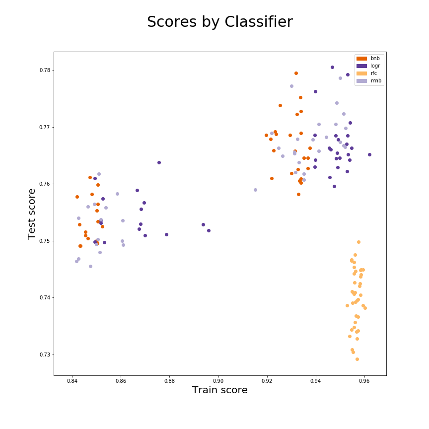

# Extracting meaningful differences between r/SequelMemes and r/PrequelMemes subreddits through Natural Language Processing of post titles

## Abstract
[Memes](https://en.wikipedia.org/wiki/Meme) are one of the *de facto* forms of expression on the internet. Image macros containing text are shared across various venues of the internet and can express a multitude of emotional states.

[Star Wars](https://en.wikipedia.org/wiki/Star_Wars) is an epic, multi-saga science fiction opera. It's influence on popular culture is [fairly vast](https://en.wikipedia.org/wiki/Cultural_impact_of_Star_Wars) and, through the [r/SequelMemes](https://www.reddit.com/r/SequelMemes) and [r/PrequelMemes](https://www.reddit.com/r/PrequelMemes) subreddits, has become transmuted into the comedic currency of an [obscure internet subculture](https://www.reddit.com/r/SequelMemes/comments/9fjcxj/light_darkness_a_balance/).

The image macros from these subreddits reflect an interesting juxtaposition of utilizing similar themes but are represented by references from their respective trilogy films that are often interweaved with other image macro themes or pop cultural references:
  

<em><a href="https://www.reddit.com/r/SequelMemes/comments/9e2q22/swole_patrol/">A meme from r/SequelMemes</a> making a reference to <a href="https://en.wikipedia.org/wiki/I_Love_It_(Kanye_West_and_Lil_Pump_song)">Kanye West's "I Love It" music video</a> and a distorted image of a <a href="https://en.wikipedia.org/wiki/Kylo_Ren">shirtless Kylo Ren</a>, a character in the Star Wars sequel trilogies.</em>

  

<em><a href="https://www.reddit.com/r/PrequelMemes/comments/9gb6o9/bad_oc/">A meme from r/PrequelMemes</a> referencing <a href="https://en.wikipedia.org/wiki/J._Jonah_Jameson#Spider-Man">J. Jonah Jameson </a>, a character from the <a href="https://en.wikipedia.org/wiki/Spider-Man">Spider-Man comicbook series</a> alongside a scene containing <a href="https://en.wikipedia.org/wiki/Obi-Wan_Kenobi#/media/File:Obiwan1.jpg">Obiwan Kenobi</a> from <a href="https://en.wikipedia.org/wiki/Star_Wars:_Episode_III_%E2%80%93_Revenge_of_the_Sith">Revenge of the Sith</a></em>

 

Given that both of these subreddits contain an irreverent sense of humor tied to Star Wars through the use of image macros, I wanted to explore if the language used in the titles of the posts gave any signal as to make a given post identifiable to it's respective subreddit.
  

## Executive Summary

### Problem Statement
What I wanted to explore by collecting r/SequelMemes and r/PrequelMemes JSON data was to see if it were possible to identify the subreddit a meme is posted on by the language of it's post title. My hypothesis is that the image macros alone do not solely provide signal for this classification but rather that the language used within a post's title can provide this context.

### Description of Data
In order to perform this analysis, I wrote a [script in Node that fetched JSON data from the Pushshift.io API](./data_fetching/pushshift.js). This data was written to two folders ([now three folders](./data_fetching/json2/)) and contains paginated JSON files.

To combine the files, I wrote a [script in Node combined the JSON files into one long list of JSON objects](./data_fetching/merge.js). This was so that I can load 2 separate lists directly into a pandas dataframe without too much need for manipulation.

In total there were **13250** titles for **r/PrequelMemes** and *14600* titles for *r/SequelMemes* collected for this analysis. 

The only additional features were a creation date from the JSON data (the *created_utc* property) that I used to look at the timespan of the collected posts of both subreddits. I also encoded a feature to determine whether or not a given meme came from the r/SequelMemes subreddit so that I could I have a basis for classification (the *is_sequel_meme* feature). 

Here are the top 5 terms for each subreddit:

### Model Selection

I tested using a Tfidf Vectorizer and Count Vectorizer with varying document frequencies and ngram ranges, a Random Forest Classifier, a Multinomial Naive Bayes Classifier, and a Bernoulli Naive Bayes Classifier. Other classifiers were tested but either performed very poorly or ran so slow that I could not complete a train test split.

I decided that using a CountVectorizer with an ngram range of 1 to 3 and max document frequency of 25% with Bernoulli Naive Bayes Classifier is the most appropriate choice. This is because it offered great performance and I believe that if the goal was to classify more posts, it would scale significantly better than the best performing score which was a highly tuned Logistic Regression model. The hyperparameter values were also present in most of the top 10 performing models.

Most of the hyperparameter tuning lead to more overfit models; however, my feeling is that a Bernoulli Naive Bayes is generally good with this sort of classification as it is optimized for natural language processing. The overall performance increase with parameter tuning was not significant; this is demonstrated in the following plot:

### Conclusions
    
Generally speaking, the selected model is 77% accurate with higher disposition of misclassification towards false positives rather than false negatives. This means that it generally mistakes posts titles from r/SequelMemes as if they were posts titles from r/PrequelMemes.

I think this makes sense because r/PrequelMemes is an older subreddit and has a larger number of posts. It may also be that there is shared language that may increase this misclassification rate given that both of these subreddits are very referenced based.

I also think that these subreddits have a very similar sense of humor and that gets encoded in the titles albeit with different sets of references.

### Next steps
As far as next steps, I think some form of image classification would go a long way to reveal whether it can improve the subreddit classification or create more noise. 

I do not think that there is much that I can do to improve the current accuracy score other than this. I had attempted using Singular Value Decomposition, a method to encode signal that is shared across multiple words as a means to remove noise; however, the initial scores were bad and I could not run any of the non-Naive Bayes models.

I think for the most part, the model that I have selected is ready for production in that it is designed to perform generally well with text classification. I think if I were to factor in image classification, then I may have to select a different model; however, I think any Naive Bayes classifier will generally perform well with a given corpus of text.

I think the main application for looking at meme titles for classification would be to better understand [virality](https://en.wikipedia.org/wiki/Viral_phenomenon) and it's impact across different internet subcultures.

## Notebooks
[Notebooks are located here.](./notebooks/)

## Presentation
[PDF of presentation is here.](./presentation/Star%20Wars%20Classification.pdf)

